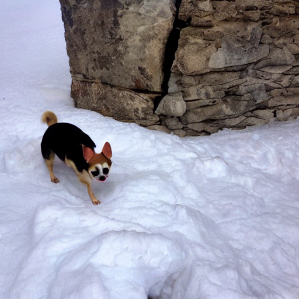
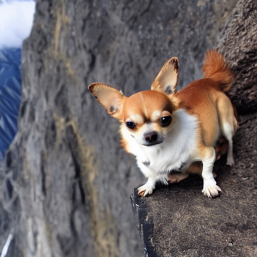

# Program engineering 1
----
team:
- Ishmitov D.R
- Muravied A.V.
----
## How to run

``bash runPractice.sh number_of_practice surname_of_student``  

_for example:_
``bash runPractice.sh 1 ishmitov``

----

### Practice 1
- Description of project
  - **ishmitov**
    - **Technical requirements**
      - about 5Gb of storage space
      - Linux/Mac os (CUDA, ARM)
    - **Overview**
       - Russian or english text to picture based on two models:
         - [runwayml/stable-diffusion-v1-5](https://huggingface.co/runwayml/stable-diffusion-v1-5) - for creation pictures
         - [Helsinki-NLP/opus-mt-ru-en](https://huggingface.co/Helsinki-NLP/opus-mt-ru-en) - for translation prompt from russian to english
    - **How is it work**
      - write your prompt to the cli, for example "Chihuahua is climbing the Everest" or in Russian "Чихухуа карабкается на Эверест"
      - wait then application produce you path to the picture
      - check the picture by the link
        - 
      - keep going until you get bored
        - 
      - write 'exit' and application will have completed
  - **muraviev**
    - text